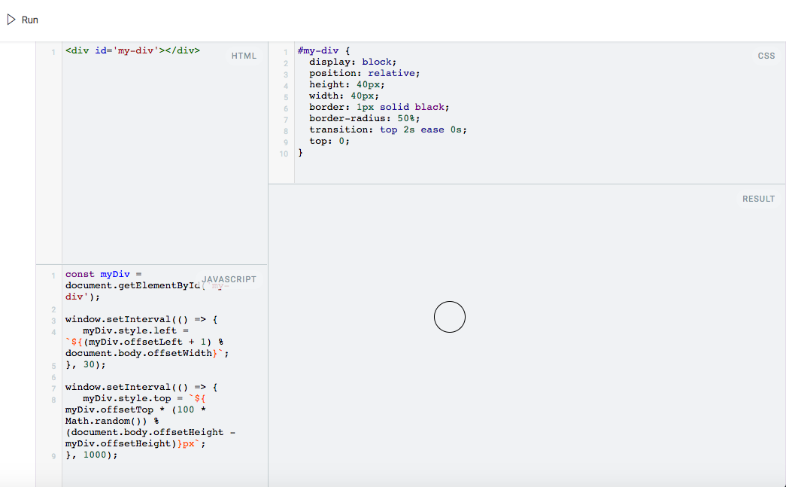

# jsTinker

jsTinker is a HTML, CSS, and JavaScript sandbox inspired by [JSFiddle](https://jsfiddle.net/).

Much like JSFiddle, jsTinker features a 4-pane resizable split screen with one pane dedicated to HTML, JavaScript, CSS, and Results respectively.

By clicking the run button, the code is executed in the results pane.

